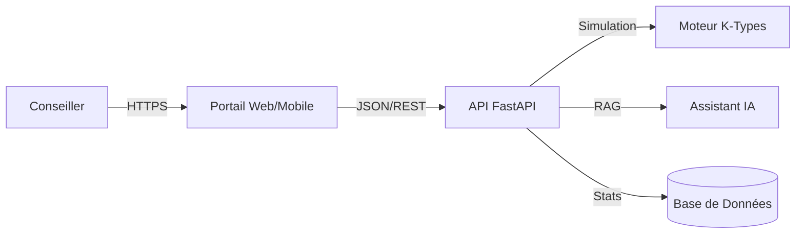

# Architecture Technique - Portail Conseiller AgriTransition

Ce document détaille l'architecture technique de la solution, conçue comme un outil d'aide à la décision pour les conseillers agricoles.

## 1. Vue d'ensemble (Architecture 3-Tiers)

L'application repose sur une architecture moderne et découplée, intégrant un tableau de bord, un simulateur et un assistant IA.



### Composants
1.  **Frontend (`frontend.html`)** : Interface "Portail Conseiller" (HTML5/Bootstrap).
    *   *Tableau de Bord* : Vue d'ensemble du portefeuille clients et KPI globaux.
    *   *Simulateur* : Outil interactif pour les rendez-vous terrain.
    *   *Assistant IA* : Interface de chat pour interroger la base de connaissances.
2.  **Backend (`backend.py`)** : API RESTful (FastAPI).
    *   *Endpoints* : `/advisor/stats`, `/simulate`, `/chat`.
    *   *Logique* : Orchestration des simulations systémiques et réponses contextuelles du chat.
3.  **Moteur IA** :
    *   *K-Types* : Logique de classification et projection des fermes.
    *   *Chatbot* : Système RAG (Retrieval-Augmented Generation) pour assister le conseiller.

## 2. Fonctionnalités Clés

### A. Tableau de Bord Conseiller (`/advisor/stats`)
Affiche les métriques agrégées du portefeuille :
- Nombre d'agriculteurs suivis.
- Potentiel de réduction carbone cumulé.
- Actions les plus recommandées.

### B. Simulation Terrain (`/simulate`)
Lors d'une visite, le conseiller saisit la structure de la ferme.
*   **Approche Systémique** : Modification d'une variable (ex: Part d'Herbe) -> Impact global recalculé (Autonomie, Carbone, Marge).
*   **Visualisation** : Comparaison "Avant/Après" immédiate pour faciliter la pédagogie.

### C. Assistant IA (`/chat`)
Un chatbot contextuel pour répondre aux questions du conseiller en temps réel :
- *Réglementaire* : "Quelles aides pour la haie ?"
- *Technique* : "Impact de l'augmentation du maïs sur le bilan humique ?"
- *Contexte* : L'IA a accès aux données de la simulation en cours pour personnaliser ses réponses.

## 3. Flux de Données (Exemple : Visite)

1.  **Dashboard** : Le conseiller prépare sa visite en consultant l'historique.
2.  **Saisie** : Sur place, il rentre les données structurelles (SAU, UGB, Filière).
3.  **Simulation** : Il utilise le slider pour montrer à l'agriculteur l'impact d'une augmentation de l'herbe (+20%).
4.  **Chat** : L'agriculteur pose une question sur les subventions. Le conseiller interroge le chat intégré qui fournit les dispositifs PCAE applicables.

## 4. Guide de Démarrage

### Pré-requis
- Python 3.9+
- Navigateur Web

### Installation & Lancement

1.  **Installer les dépendances** :
    ```bash
    pip install fastapi uvicorn pydantic
    ```

2.  **Lancer le Backend** :
    ```bash
    python backend.py
    ```
    *Le serveur écoute sur http://localhost:8000*

3.  **Accéder au Portail** :
    *   Ouvrir `frontend.html` dans le navigateur.
    *   Naviguer entre les onglets Dashboard, Simulation et Chat.

## 5. Évolutions Futures

*   **Authentification** : Gestion multi-comptes conseillers.
*   **Base de Données Réelle** : Connexion à PostgreSQL pour persister les suivis.
*   **IA Générative** : Connexion à un vrai LLM (OpenAI/Mistral) avec indexation vectorielle des fiches techniques INOSYS.
