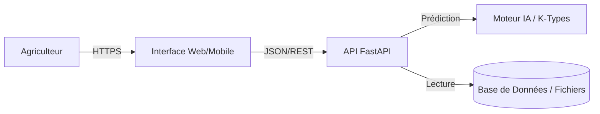

# Architecture Technique - Assistant Transition Agricole

Ce document détaille l'architecture technique de la solution, les choix technologiques et le flux de données.

## 1. Vue d'ensemble (Architecture 3-Tiers)

L'application repose sur une architecture moderne et découplée, facilitant la maintenance et l'évolutivité.



### Composants
1.  **Frontend (`frontend.html`)** : Interface utilisateur légère (HTML5/Bootstrap/JS Vanilla).
    *   *Rôle* : Collecte les données de la ferme et affiche les résultats.
    *   *Avantage* : Fonctionne sur tout navigateur (PC/Mobile) sans installation.
2.  **Backend (`backend.py`)** : Serveur d'application Python (FastAPI).
    *   *Rôle* : Valide les données, orchestre la logique métier et sert les prédictions.
    *   *Avantage* : Très haute performance, validation automatique des données (Pydantic), documentation auto-générée (Swagger UI).
3.  **Moteur de Décision (Mocké actuellement)** :
    *   *Rôle* : Contient la logique des Cas-Types (K-Types) et les règles de recommandation.
    *   *Futur* : Sera remplacé par le modèle XGBoost entraîné sur les données INOSYS.

## 2. Flux de Données (Data Flow)

### Étape 1 : Saisie Utilisateur
L'agriculteur renseigne les indicateurs clés :
- Structure : `SAU` (Surface), `UGB` (Cheptel).
- Pratiques : `Chargement`, `Autonomie Fourragère`.

### Étape 2 : Traitement API (`/predict`)
Le backend reçoit un objet JSON :
```json
{
  "region": "Bretagne",
  "otex": "Bovins Lait",
  "sau": 80,
  "ugb": 60,
  "autonomie_fourragère": 65
}
```

### Étape 3 : Logique de "Gap Analysis"
1.  **Identification du Profil** : Le système détermine que c'est une ferme de type "Laitier Intensif".
2.  **Comparaison** : Il compare les indicateurs avec le K-Type cible "Laitier Durable".
3.  **Génération d'Actions** :
    *   *Si Autonomie < 70%* -> Recommander "Implanter méteil/luzerne".
    *   *Si Chargement > 1.8* -> Recommander "Optimisation du cheptel".

### Étape 4 : Restitution
Le frontend reçoit et affiche :
- Le score de transition.
- Le gain carbone potentiel (en tonnes CO2).
- Une liste de cartes "Actions" priorisées par impact.

## 3. Guide de Démarrage

### Pré-requis
- Python 3.9+
- Navigateur Web

### Installation & Lancement

1.  **Installer les dépendances** :
    ```bash
    pip install fastapi uvicorn pydantic
    ```

2.  **Lancer le Backend** :
    ```bash
    python backend.py
    ```
    *Le serveur démarrera sur http://localhost:8000*

3.  **Ouvrir le Frontend** :
    *   Ouvrir simplement le fichier `frontend.html` dans votre navigateur.
    *   Remplir le formulaire et cliquer sur "Lancer la Simulation".

## 4. Évolutions Techniques Futures

*   **Persistance** : Ajouter une base de données (PostgreSQL/SQLite) pour sauvegarder les simulations des utilisateurs.
*   **Modèle ML** : Remplacer la logique heuristique (`determine_ktype`) par le chargement du modèle XGBoost (`model.load_model('xgb_transition.json')`).
*   **Authentification** : Ajouter JWT pour sécuriser l'accès aux données des agriculteurs.
