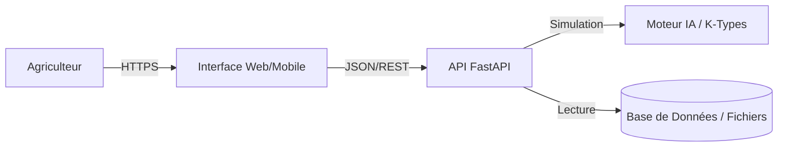

# Architecture Technique - Assistant Transition Agricole

Ce document détaille l'architecture technique de la solution, les choix technologiques et le flux de données.

## 1. Vue d'ensemble (Architecture 3-Tiers)

L'application repose sur une architecture moderne et découplée, facilitant la maintenance et l'évolutivité.



### Composants
1.  **Frontend (`frontend.html`)** : Interface utilisateur légère (HTML5/Bootstrap/JS Vanilla).
    *   *Rôle* : Collecte les données structurelles et offre une interface de simulation interactive (Sliders).
    *   *Avantage* : Fonctionne sur tout navigateur (PC/Mobile) sans installation.
2.  **Backend (`backend.py`)** : Serveur d'application Python (FastAPI).
    *   *Rôle* : Valide les données, orchestre la logique systémique et calcule les impacts.
    *   *Avantage* : Très haute performance, validation automatique des données (Pydantic).
3.  **Moteur de Décision (Mocké actuellement)** :
    *   *Rôle* : Contient la logique des Cas-Types (K-Types) et les règles de comportement du système global.

## 2. Flux de Données (Data Flow)

### Étape 1 : Initialisation Situation
L'agriculteur renseigne les indicateurs structurels :
- Structure : `SAU` (Surface), `UGB` (Cheptel).
- Filière : `FILIERE` (ex: Bovins Lait).
- Pratique Actuelle : `Part d'Herbe`.

### Étape 2 : Simulation Interactive (`/simulate`)
Le backend reçoit un objet JSON contenant l'état actuel et la variable cible :
```json
{
  "region": "Bretagne",
  "filiere": "Bovins Lait",
  "sau": 80,
  "ugb": 60,
  "part_herbe": 50
}
```
*Paramètre URL* : `?target_part_herbe=70`

### Étape 3 : Logique Systémique
1.  **Calcul État Initial** : Le système estime l'autonomie et le carbone actuels basés sur les ratios standards.
2.  **Projection** : Il recalcule ces métriques avec la nouvelle variable (70% d'herbe).
3.  **Comparaison** :
    *   *Delta Autonomie* : +15 pts (Moins d'achats).
    *   *Delta Carbone* : -10 tonnes (Plus de stockage).

### Étape 4 : Restitution
Le frontend reçoit et affiche :
- Les deux états (Actuel vs Simulé) côte à côte.
- Des messages d'analyse explicatifs ("Augmenter l'herbe améliore l'autonomie...").

## 3. Guide de Démarrage

### Pré-requis
- Python 3.9+
- Navigateur Web

### Installation & Lancement

1.  **Installer les dépendances** :
    ```bash
    pip install fastapi uvicorn pydantic
    ```

2.  **Lancer le Backend** :
    ```bash
    python backend.py
    ```
    *Le serveur démarrera sur http://localhost:8000*

3.  **Ouvrir le Frontend** :
    *   Ouvrir simplement le fichier `frontend.html` dans votre navigateur.
    *   Remplir le formulaire et utiliser le slider pour simuler.

## 4. Évolutions Techniques Futures

*   **Modèle ML** : Remplacer la logique heuristique par un modèle XGBoost entraîné sur les données INOSYS pour prédire les impacts avec précision.
*   **Multi-Variables** : Permettre de modifier plusieurs variables en même temps (ex: Herbe + Cheptel).
